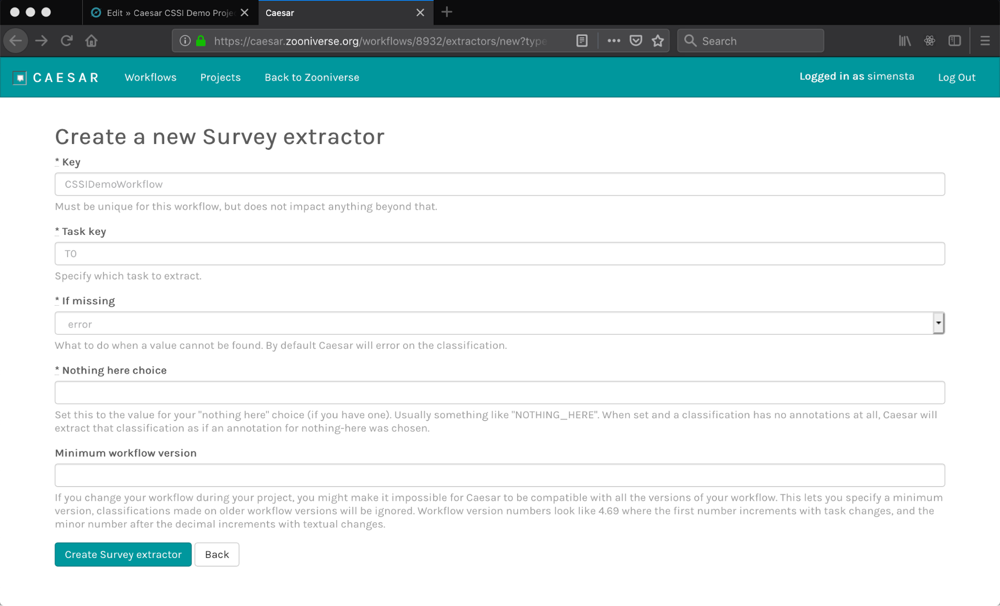
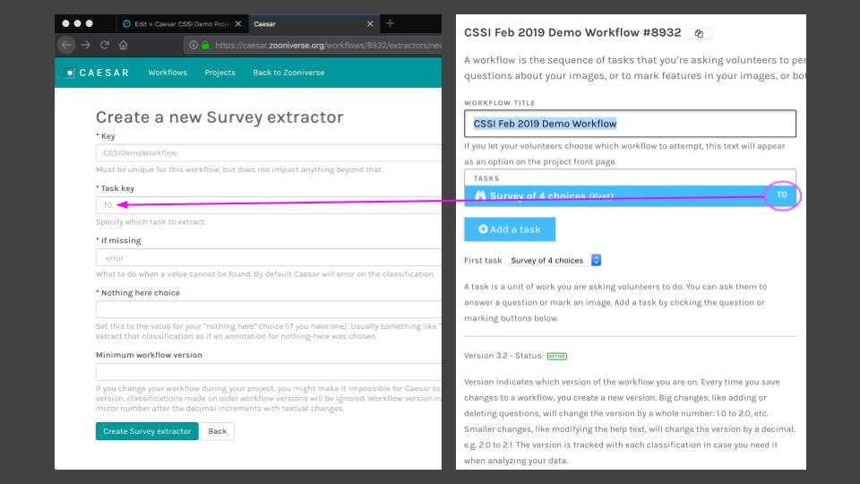
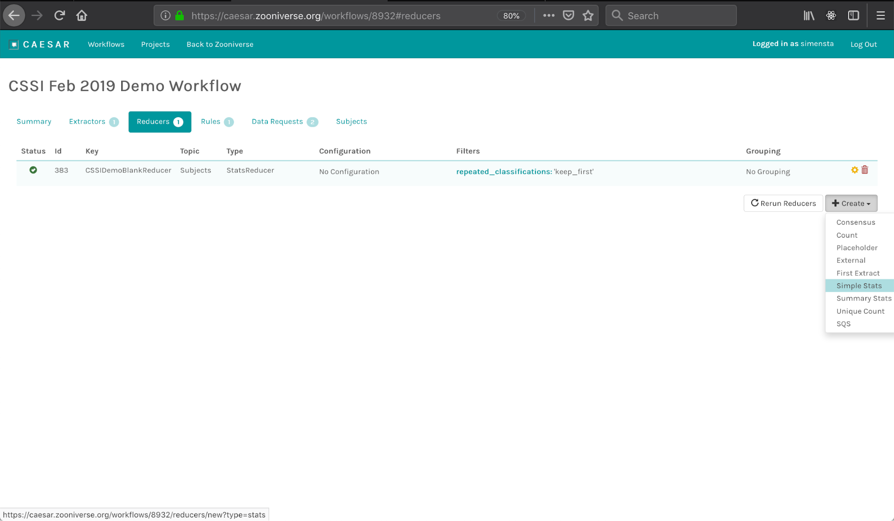
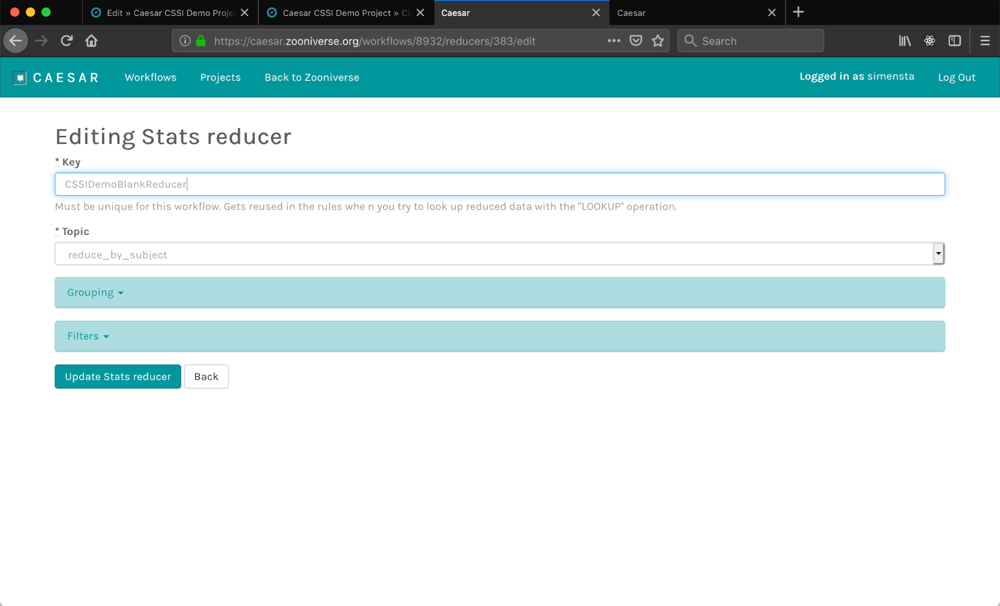
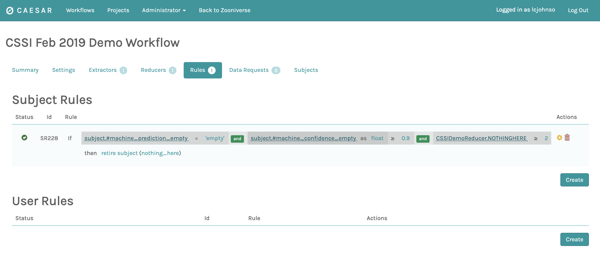
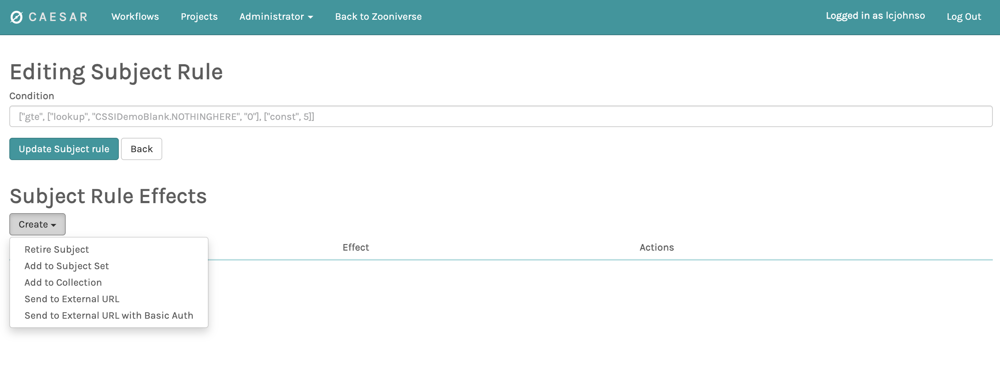
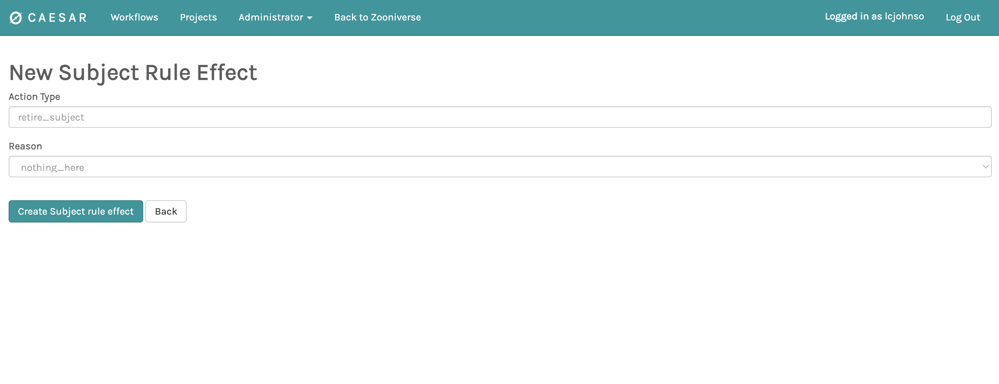
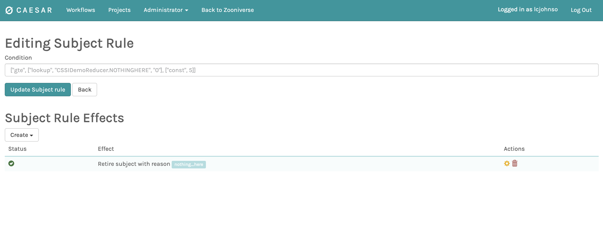

# Introduction

Caesar ([https://github.com/zooniverse/caesar](https://github.com/zooniverse/caesar)) is Zooniverse’s decision engine and real-time data processing pipeline. Caesar monitors volunteer classifications as they are submitted (i.e., a Lambda script monitors the Kinesis data stream and forwards to Caesar's HTTP API; see [kinesis-to-http](https://github.com/zooniverse/caesar/tree/master/kinesis-to-http)), then extracts, reduces, and acts on these data in real time.

Project teams primarily interact with and configure Caesar using the applications Web UI at [https://caesar.zooniverse.org](https://caesar.zooniverse.org). The [Panoptes Python Client](https://github.com/zooniverse/panoptes-python-client) can also be used for programatic interactions with the Caesar API; see examples in the [Python Client docs](https://panoptes-python-client.readthedocs.io/en/latest/user_guide.html#tutorial-adding-a-workflow-to-caesar).

Caesar interacts with and is extended by the Zooniverse's [Aggregations](https://aggregation-caesar.zooniverse.org/docs) application, specifically through the use of online extractors and reducers made available through the Zooniverse-hosted Aggregations app that are integrated using Caesar's external extractor and reducer functionality.

## Data Flow

- **Extract:** For each classification, extractors generate extracts, which pull essential information out of the full classification record. 
- **Reduce:** Whenever extracts change, Caesar then runs reducers that generate reductions. Each reducer receives all the extracts and aggregates the data from multiple classifications into key-value pairs. 
- **Act:** Whenever a reduction changes, Caesar evaluates rules that can trigger effects. A rule is a boolean statement that reflects on reductions (referenced by reducer key) and other information (e.g., subject metadata), and uses logic clauses like `and` / `or` / `not` in its defined condition. When the rule condition evaluates to `true`, effects associated with that rule will be performed. For instance, an effect might trigger the action of retiring a subject.

```
┏━━━━━━━━━━━━━━━━━━┓
┃     Kinesis      ┃
┗━━━┳━━━━━━━━━━━━━━┛
    │                                                       ┌ ─ ─ ─ ─ ─ ─ ─ ─ ─ ─ ─ ─ ─ ┐
    │                                                         EXTRACTS:
    │   ┌ ─ ─ ─ ─ ─ ─ ─ ─ ┐         ┌──────────────────┐    │                           │
    ├──▶ Classification 1  ────┬───▶│ FlaggedExtractor │──────▶{flagged: true}
    │   └ ─ ─ ─ ─ ─ ─ ─ ─ ┘    │    └──────────────────┘    │                           │
    │                          │    ┌──────────────────┐
    │                          └───▶│ SurveyExtractor  │────┼─▶{raccoon: 1}             │
    │                               └──────────────────┘
    │   ┌ ─ ─ ─ ─ ─ ─ ─ ─ ┐         ┌──────────────────┐    │                           │
    └──▶ Classification 2  ────┬───▶│ FlaggedExtractor │──────▶{flagged: false}
        └ ─ ─ ─ ─ ─ ─ ─ ─ ┘    │    └──────────────────┘    │                           │
                               │    ┌──────────────────┐
                               └───▶│ SurveyExtractor  │────┼─▶{beaver: 1, raccoon: 1}  │
                                    └──────────────────┘
   ┌ ─ ─ ─ ─ ─ ─ ─ ─ ─ ─ ─ ─ ─ ─ ┐                          └ ─ ─ ─ ─ ─ ─ ─ ─ ─ ─ ─ ─ ─ ┘
     REDUCTIONS:                                                          │
   │                             │                                        │
      {                                                                   │
   │    votes_flagged: 1,        │  ┌──────────────────┐                  │
        votes_beaver: 1,      ◀─────│ VoteCountReducer │◀─────────────────┘
   │    votes_raccoon: 2         │  └──────────────────┘
      }
   │                             │
                                                                              ┏━━━━━━━━━━━━━━━━┓
   │  {                          │  ┌──────────────────┐                      ┃Some script run ┃
        swap_confidence: 0.23 ◀─────│ ExternalReducer  │◀────HTTP API call────┃by project owner┃
   │  }                          │  └──────────────────┘                      ┃  (externally)  ┃
                                                                              ┗━━━━━━━━━━━━━━━━┛
   └ ─ ─ ─ ─ ─ ─ ─ ─ ─ ─ ─ ─ ─ ─ ┘
                  │
                  │
                  │                 ┌──────────────────┐         POST         ┏━━━━━━━━━━━━━━━━┓
                  └────────────────▶│       Rule       │───/subjects/retire──▶┃    Panoptes    ┃
                                    └──────────────────┘                      ┗━━━━━━━━━━━━━━━━┛
```

To make this more concrete, here is an example for a survey task workflow where:

1. An extractor emits key-value pairs like `lion=1` when the user tagged a lion in the image.
2. A reducer combines multiple classifications by adding up the lion counts, emitting `lion=5, coyote=1`
3. A rule then checks `lion > 4`, which returns true, and therefore Caesar retires the image.

See also the diagram to the right, which provides a visual demonstration of an example flow.

# Usage

Caesar listens to classification events for workflows from the event stream. The tasks and subject sets connected to a specific workflow are configured via the [project builder](https://www.zooniverse.org/lab/). To configure the data handling: 

 + Go to the [Caesar Web UI](https://caesar.zooniverse.org/) and login.
 + Click on "Workflows" and click "Add" and enter the workflow ID (you can find this in the Project Builder page).
 + Configure extractors and reducers.
 + Configure rules and effects.

## Configure Extractors

To create an extractor:

+ From the workflow summary page, click on the ‘Extractors’ tab. Press the ‘+Create Extractor’ button. You will be prompted to choose a type of extractor. 



+ Fill out the form for the new extractor. The generic fields for all extractors are:
  + The `key` is an alpha-numeric identifier for this extractor that is unique to this workflow. Set a short, but descriptive string for this, e.g., `galaxy-type-extract`.
  + The `task key` is the identifier of the task in the workflow. You can get this information from the project builder page (see image below)

  + The `if missing` entry allows you to decide what should be done if the classification data is missing. The default choice is to error out of that extract. 
  + The `minimum workflow version` provides the choice to filter out early versions of the workflow, useful for limiting the data domain to post-development or post-launch classifications.
  + Each extractor will also have unique fields that need to be filled out, as detailed below.

## Configure Reducers

Reducers can be created from the "Reducers" tab in the workflow configuration page. Like extractors, Caesar features a set of standard reducers, which are task dependent. To add a reducer to your workflow, click on the 'Create' button and choose from dropdown: 



This will take you to a configuration window for that reducer:



All reducers share the same set of configuration parameters, but given their individual flexibility it can be tricky to make decisions. See [detailed documentation](#reducer-parameters) of all parameters below. Overall, default values are OK in most cases.

## Configure Rules & Effects

Rules and effects can be added from the "Rules" tab in the workflow configuration page. Rules typically apply to subjects, but can also apply to users as well.

As an example, we will create an subject rule for early retirement. From the workflow's Rules page (see below), create a new rule by clicking the "Create" button.



Clicking create will open the rule editing page (see below). Enter the condition; here we use `["gte", ["lookup", "CSSIDemoReducer.NOTHINGHERE", "0"], ["const", 5]]` to define that effects should trigger when the CSSIDemoReducer tracks five or more `NOTHINGHERE` classifications. Next, we select a corresponding effect that triggers when the condition is met; here we select the "Retire Subject" option.



Selecting the effect option will open the effect editing page (see below). Confirm the action type (tied to the choice of effect chosen from dropdown) and "Reason" parameter in the case of the retirement effect. Click "Create Subject rule effect" to complete effect configuration.



Once the condition and effects are configured (see below), click "Update Subject rule" button in the subject rule editing page to complete the configuration.



By default all configured rules on a workflow will be evaluated each time the reducers are run. Rule evaluation may be disabled from the settings panel -- for example, to temporarly halt early retirements.
